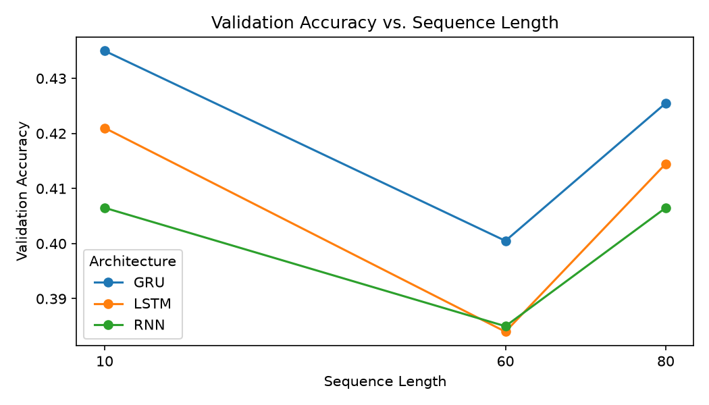

# Sequence Prediction System Using Recurrent Neural Networks

## Abstract
This project develops a character-level sequence prediction system using recurrent neural networks. The system receives a fixed-length sequence of characters and predicts the next character. Simple RNN, LSTM and GRU architectures are trained and compared to investigate their ability to model short-term and long-term dependencies.

## Objectives
1. Build a sequence prediction pipeline.
2. Convert text into fixed-length character sequences.
3. Train Simple RNN, LSTM and GRU models.
4. Compare validation accuracy, loss, parameter count and training time.
5. Generate text from a user-provided seed sequence.

## Dataset
Tiny Shakespeare is used as the default dataset. The dataset contains Shakespearean text and is treated as a character sequence.

## Methodology
Text is converted into integer character IDs. For every window of N characters, the next character becomes the target. The data is split chronologically into training and validation portions.

## Architecture
Embedding → Recurrent Layer → Dropout → Dense Softmax

Three recurrent layers are evaluated:
- SimpleRNN
- LSTM
- GRU

## Short-Term vs Long-Term Dependencies
A Simple RNN maintains a hidden state but can experience vanishing/exploding gradients when dependencies span many time steps. LSTM introduces a cell state and gates to regulate information. GRU uses update and reset gates and has a simpler structure.

## Evaluation
The experiment records:
- Validation accuracy
- Validation loss
- Training time
- Trainable parameter count
- Generated sequence quality

## Results
The baseline experiment used a sequence length of 60 and the default eight training
epochs with early stopping.

| Architecture | Validation Accuracy | Validation Loss | Training Time | Parameters |
|---|---:|---:|---:|---:|
| Simple RNN | 0.3850 | 2.1358 | 22.57 s | 37,249 |
| LSTM | 0.3840 | 2.1161 | 73.39 s | 111,361 |
| GRU | 0.4005 | 2.0412 | 71.46 s | 87,041 |

### Dependency-Length Experiment

To examine the effect of context length, all three architectures were also trained
with sequence lengths of 10 and 80. The complete measurements are in
`outputs/dependency_metrics.csv`, and the validation-accuracy comparison is shown
below.

| Sequence Length | Simple RNN | LSTM | GRU |
|---:|---:|---:|---:|
| 10 | 0.4065 | 0.4210 | 0.4350 |
| 60 | 0.3850 | 0.3840 | 0.4005 |
| 80 | 0.4065 | 0.4145 | 0.4255 |

The gated models achieved higher validation accuracy than Simple RNN at both
additional sequence lengths. However, this small experiment did not produce a
monotonic or dramatic Simple RNN decline: its measured accuracy was 0.4065 at
length 10 and 80, compared with 0.3850 at length 60. The results therefore support
the architectural motivation for LSTM and GRU, but a larger corpus or a controlled
long-range dependency benchmark would be needed for a stronger claim about
accuracy degradation with sequence length.

## Conclusion
The experiment provides an empirical comparison of recurrent architectures. The final conclusion should be based on the measured results. LSTM and GRU include gating mechanisms designed to preserve useful information over longer dependencies, while Simple RNN provides a simpler baseline.

## Future Scope
- Word-level prediction
- Sentiment classification
- Sensor-based human activity classification
- Time-series forecasting
- Bidirectional RNNs
- Attention and Transformer models
